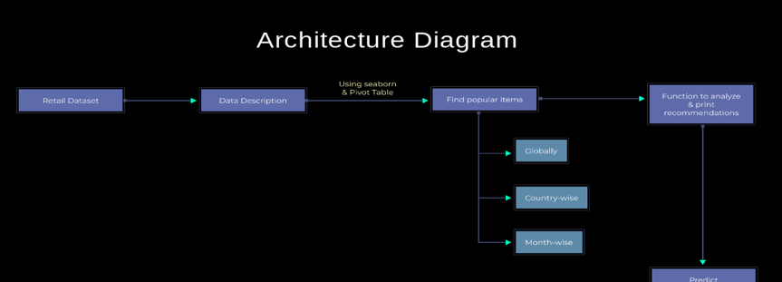

# Simple Recommender System: Online Retail Data

• Identified popular items globally, country-wise, and month-wise, boosting item discovery.
• Improved similar user preferences using a user-item matrix structure, representing interactions between
users and items, with a focus on users with a correlation of 65% or more with 13,246 users.
• Achieved a recommendation improvement of approximately 25% based on computed similarity matrix and user
engagement metrics, including Kendall’s tau correlation.

## Problem Statement

If you have tried online shopping, you must have noticed that when you are checking out a product on an eCommerce site, there is a list of suggested products that you are presented with. In this project, you will work on different types of recommendation systems
For this, we are attaching a dataset containing information about recommendation system for online retail data, so that we can understand what type of product can be recommended.

## Provided Architecture Diagram

- **Metrics Overview**
  - Invoice Number: This is the number that identifies a transaction.

  - Stock Code: This refers to the product ID.

  - Description: This describes the product that a user purchased.

  - Quantity: It specified the quantity of the item purchased.

  - Invoice Date: The date on which the transaction took place.

  - Unit Price: Price of one product.

  - Customer ID: It identifies the customer.
  
  - Country: The country where the transaction was performed.

